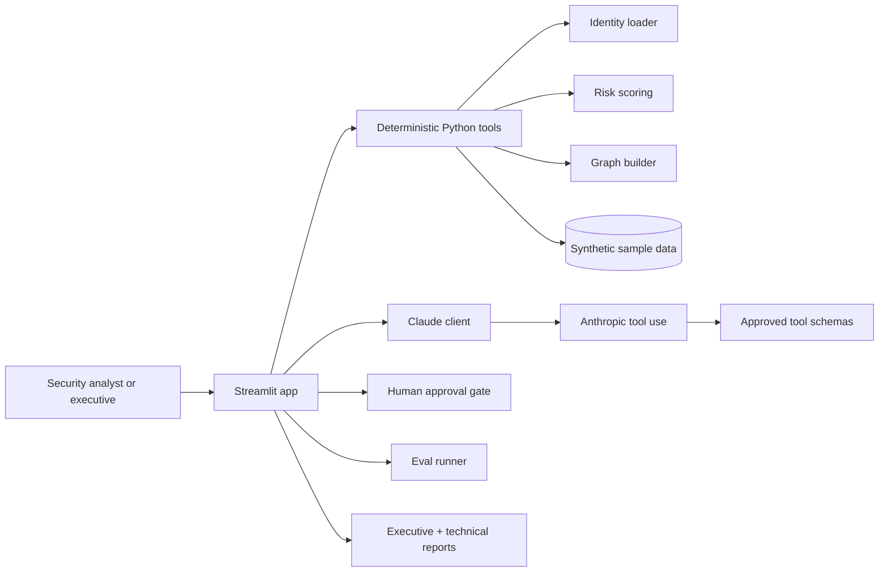

# Cleared Identity Co-Pilot

> **Synthetic demo only:** every identity, tenant, mission detail, account number, and finding in this repository is fictional.

Cleared Identity Co-Pilot is a production-quality Streamlit portfolio demo that shows how Claude can reason about cross-cloud identity exposure for a synthetic federal customer, **Orion Federal Analytics Agency**, while staying grounded in deterministic Python tooling and explicit human approval gates.

## Why this matters for federal customers

Federal identity programs rarely fail because of one isolated control. They fail at the seams: Azure and AWS teams reviewing access separately, privileged users keeping standing roles, service accounts losing ownership, and stale access surviving transfers or contract end dates. This demo shows how a modern AI assistant can help analysts synthesize those cross-cloud signals into evidence-backed decisions without giving the model direct execution authority.

## Architecture



## Why Claude (vs rules engine / smaller model)

A rules engine can flag SMS MFA or overdue reviews, but it cannot easily connect Tamara Osei's transfer history, Jenny Tran's credential sharing, and Sandra Okafor's stale emergency access into one mission-relevant narrative. Claude is used here as the reasoning and communication layer because it can gather evidence through tools, keep facts distinct from assumptions, and produce both executive and technical outputs while following a structured schema.

## How deterministic tools and Claude reasoning are separated

- Deterministic Python code loads the data, computes risk, and builds the graph.
- Claude can only see what approved tools return.
- The system prompt forbids invented facts and requires evidence citations.
- Recommendations are shown to a human first; they are not executed automatically.

## Safety architecture summary

- Synthetic-data-only dataset with repeated UI and docs disclaimers.
- Optional API access with graceful cached fallback when no key is present.
- Tool-use loop restricted to a small approved function set.
- Human approval gate for any non-trivial recommended action.
- No real credentials or tenant-connected connectors in the demo.

## Quickstart

```bash
cd /path/to/caib
python -m venv .venv
source .venv/bin/activate          # Windows: .venv\Scripts\activate
pip install -r cleared-identity-copilot/requirements.txt
cp cleared-identity-copilot/.env.example cleared-identity-copilot/.env
streamlit run cleared-identity-copilot/app.py
```

If `ANTHROPIC_API_KEY` is not set, the app still works and shows a realistic cached Claude analysis.

## First time? Read the full guide

[**📖 Getting Started Guide**](cleared-identity-copilot/GETTING_STARTED.md) — step-by-step installation, tab-by-tab tour, FAQ, and a 5-minute demo script written for any skill level.

## FastAPI ICAM agent (also in this repo)

```bash
curl -s http://127.0.0.1:8080/healthz
curl -s -X POST http://127.0.0.1:8080/v1/ask -H "Content-Type: application/json" -d '{"question":"List permanent vs eligible role assignments and recommend least-privilege fixes."}' | jq .
curl -s -X POST http://127.0.0.1:8080/chat -H "Content-Type: application/json" -d '{"message":"Summarize top ICAM risk themes this week."}' | jq .
```

`/chat` calls Anthropic on Foundry when `ANTHROPIC_FOUNDRY_ENDPOINT` is set (optionally set `ANTHROPIC_FOUNDRY_API_KEY` and `ANTHROPIC_FOUNDRY_MODEL`).

## Project layout

- `cleared-identity-copilot/app.py` - main Streamlit application
- `cleared-identity-copilot/sample_data/` - synthetic cross-cloud identity data
- `cleared-identity-copilot/tools/` - deterministic tooling, Claude client, eval runner, and report writer
- `cleared-identity-copilot/evals/` - prompt suite and cached eval results
- `cleared-identity-copilot/docs/` - architecture, safety, schema, rationale, and demo script

## Documentation

- [`docs/architecture.md`](cleared-identity-copilot/docs/architecture.md)
- [`docs/safety_model.md`](cleared-identity-copilot/docs/safety_model.md)
- [`docs/why_claude.md`](cleared-identity-copilot/docs/why_claude.md)
- [`docs/demo_script.md`](cleared-identity-copilot/docs/demo_script.md)
- [`docs/output_schema.md`](cleared-identity-copilot/docs/output_schema.md)
