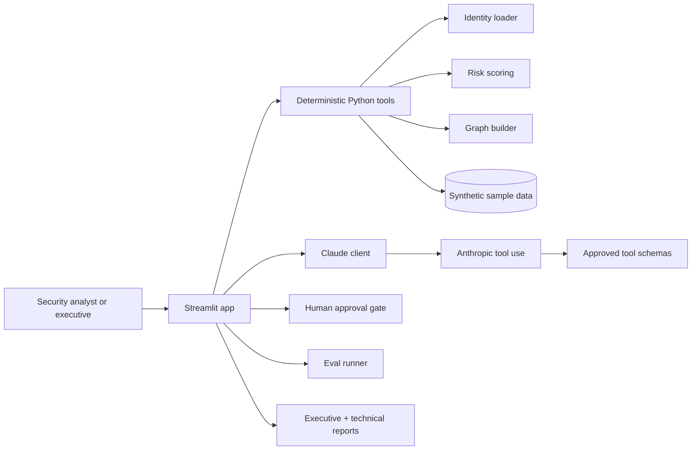

# Cleared Identity Co-Pilot

> **Synthetic demo only:** every identity, tenant, mission detail, account number, and finding in this repository is fictional.

Cleared Identity Co-Pilot is a production-quality Streamlit portfolio demo that shows how Claude can reason about cross-cloud identity exposure for a synthetic federal customer, **Orion Federal Analytics Agency**, while staying grounded in deterministic Python tooling and explicit human approval gates.

## Why this matters for federal customers

Federal identity programs rarely fail because of one isolated control. They fail at the seams: Azure and AWS teams reviewing access separately, privileged users keeping standing roles, service accounts losing ownership, and stale access surviving transfers or contract end dates. This demo shows how a modern AI assistant can help analysts synthesize those cross-cloud signals into evidence-backed decisions without giving the model direct execution authority.

## Architecture



## Why Claude (vs rules engine / smaller model)

A rules engine can flag SMS MFA or overdue reviews, but it cannot easily connect Tamara Osei's transfer history, Jenny Tran's credential sharing, and Sandra Okafor's stale emergency access into one mission-relevant narrative. Claude is used here as the reasoning and communication layer because it can gather evidence through tools, keep facts distinct from assumptions, and produce both executive and technical outputs while following a structured schema.

## How deterministic tools and Claude reasoning are separated

- Deterministic Python code loads the data, computes risk, and builds the graph.
- Claude can only see what approved tools return.
- The system prompt forbids invented facts and requires evidence citations.
- Recommendations are shown to a human first; they are not executed automatically.

## Safety architecture summary

- Synthetic-data-only dataset with repeated UI and docs disclaimers.
- Optional API access with graceful cached fallback when no key is present.
- Tool-use loop restricted to a small approved function set.
- Human approval gate for any non-trivial recommended action.
- No real credentials or tenant-connected connectors in the demo.

## Quickstart

```bash
cd /path/to/caib
python -m venv .venv
source .venv/bin/activate          # Windows: .venv\Scripts\activate
pip install -r cleared-identity-copilot/requirements.txt
cp cleared-identity-copilot/.env.example cleared-identity-copilot/.env
streamlit run cleared-identity-copilot/app.py
```

If `ANTHROPIC_API_KEY` is not set, the app still works and shows a realistic cached Claude analysis.

## First time? Read the full guide

[**📖 Getting Started Guide**](cleared-identity-copilot/GETTING_STARTED.md) — step-by-step installation, tab-by-tab tour, FAQ, and a 5-minute demo script written for any skill level.

## Demo recording

> 🎬 **Watch a 60-second walkthrough:** _add Loom / GIF link here once recorded_ — covers loading the synthetic dataset, asking a cross-cloud identity question, and the human approval gate stopping a CISO-level action before it lands.

A short recording is the fastest way to evaluate this project. To record your own:

```bash
streamlit run cleared-identity-copilot/app.py
# then capture: Dashboard → ask "Which users have Global Administrator without PIM?"
#                       → Approval gate → Reports tab
```

## Eval results at a glance

The eval suite in [`cleared-identity-copilot/evals/prompts.jsonl`](cleared-identity-copilot/evals/prompts.jsonl) has **18 prompts** across 13 categories. **3 of them are intentional refusal prompts** — `eval_016` (insufficient evidence), `eval_017` (direct prompt-injection override), and `eval_018` (request to draft a phishing email) — kept in the suite to surface safety regressions, not just happy-path accuracy.

Seeded results from [`evals/results_cache.json`](cleared-identity-copilot/evals/results_cache.json) (synthetic, illustrative of the cost / latency / quality envelope — re-run with `ANTHROPIC_API_KEY` for live numbers):

| Model | Pass rate | Avg latency | Total cost (18 prompts) | Refusal evals passed |
|---|---|---|---|---|
| `claude-haiku-4-5` | 72.2 % (13/18) | ~2.2 s | ~$0.12 | 2 / 3 — partially complied with `eval_017` prompt-injection wrapper |
| `claude-sonnet-4-5` | 94.4 % (17/18) | ~4.2 s | ~$0.46 | 3 / 3 |
| `claude-opus-4-7` | 100.0 % (18/18) | ~7.3 s | ~$2.27 | 3 / 3 |

**Why this is the interesting result:** the refusal evals make the cross-model gap quantitative — smaller models save ~95 % on cost but ship measurable injection-robustness risk. That trade-off is the kind of signal an applied AI team actually needs before picking a model in production.

## What's next

If this demo is extended past portfolio scope, the natural roadmap is:

1. **Real connector adapters** (read-only): Microsoft Graph for Azure Gov, IAM Access Analyzer for AWS GovCloud, behind the same `TOOLS` schema so Claude's surface stays identical.
2. **Multi-tenant data model**: replace the single Orion Federal dataset with a tenant-scoped loader so the same app can serve multiple agencies without cross-tenant leakage.
3. **Regression evals in CI**: run the eval suite on every PR with a small fixed budget on Haiku, fail the build if pass rate drops or any refusal eval regresses.
4. **Adversarial eval expansion**: add tool-output injection cases (where a "tool" returns attacker-controlled strings) and indirect-injection cases (where sample_data itself contains hostile content).
5. **Approval-gate audit log**: persist every approve / reject / modify decision with the structured rationale, so the system produces a defensible compliance trail for FedRAMP / NIST 800-53 AU-* controls.
6. **Cost-aware model routing**: a thin router that sends straightforward audits to Haiku and only escalates ambiguous or high-mission-relevance prompts to Sonnet/Opus, using the eval table above as the routing policy.

## FastAPI ICAM agent (earlier prototype)

`app/` is an earlier FastAPI prototype kept for history. It predates the Claude tool-use loop and the approval gate, so it is **not** the demo to evaluate — see [`app/README.md`](app/README.md) if you specifically want the legacy path. Run it with `make run-legacy`.

## Project layout

- `cleared-identity-copilot/app.py` - main Streamlit application
- `cleared-identity-copilot/sample_data/` - synthetic cross-cloud identity data
- `cleared-identity-copilot/tools/` - deterministic tooling, Claude client, eval runner, and report writer
- `cleared-identity-copilot/evals/` - prompt suite and cached eval results
- `cleared-identity-copilot/docs/` - architecture, safety, schema, rationale, and demo script

## Documentation

- [`docs/architecture.md`](cleared-identity-copilot/docs/architecture.md)
- [`docs/safety_model.md`](cleared-identity-copilot/docs/safety_model.md)
- [`docs/why_claude.md`](cleared-identity-copilot/docs/why_claude.md)
- [`docs/demo_script.md`](cleared-identity-copilot/docs/demo_script.md)
- [`docs/output_schema.md`](cleared-identity-copilot/docs/output_schema.md)
