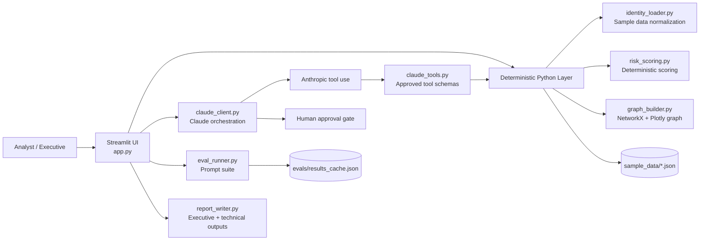

# Architecture

Cleared Identity Co-Pilot is a synthetic Streamlit portfolio demo that shows how deterministic tooling and frontier-model reasoning can be combined safely for federal identity operations.

## Components

- **Streamlit UI (`app.py`)**: Presents the six-tab experience, stores session state, visualizes risk, and enforces the approval gate before any action is logged as executed.
- **Synthetic dataset (`sample_data/`)**: Provides a complete fictional federal customer with cross-cloud identities, reviews, policy controls, and persona narratives.
- **Deterministic tool layer (`tools/identity_loader.py`, `tools/risk_scoring.py`, `tools/graph_builder.py`)**: Loads data, computes repeatable risk scores, and builds relationship graphs without invoking any model.
- **Claude integration (`tools/claude_client.py`, `tools/claude_tools.py`)**: Defines the exact tool schemas exposed to Claude, runs the tool-use loop, tracks token usage, and falls back to a cached example when an API key is absent.
- **Report generation (`tools/report_writer.py`)**: Combines deterministic data with Claude-generated prose for executive and technical outputs.
- **Evaluation harness (`tools/eval_runner.py`)**: Runs 15 mission-relevant prompts against one or more Claude models and records pass rate, latency, and cost.

## Data flow

1. Streamlit loads synthetic data and caches normalized users.
2. Risk scoring and graph construction happen locally and deterministically.
3. Claude receives only the approved tool schemas and must request evidence via tool use.
4. Tool results are returned to Claude, which produces narrative analysis plus structured JSON.
5. Any action requiring approval is surfaced to the human reviewer before it is logged.
